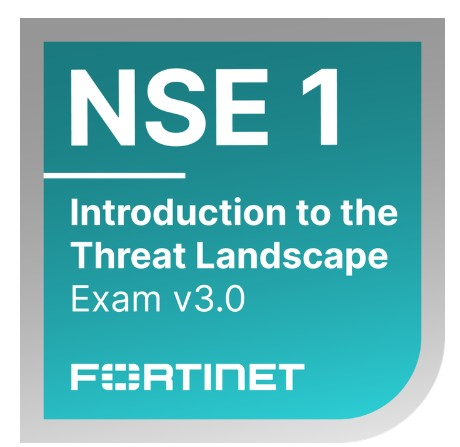

# Ciberseguridad (CIA)

---

## 🛡 Ciberseguridad basada en la TRÍADA CIA
*Modelo fundamental y marco a nivel mundial para guiar las políticas de seguridad de la información.*

| 🔒 **[ C ]** CONFIDENCIALIDAD | 🛡 **[ I ]** INTEGRIDAD | ⚡ **[ A ]** DISPONIBILIDAD |
| :---: | :---: | :---: |
| **C** | **I** | **A** |
| Solo usuarios autorizados acceden a la información protegida. | La información es exacta, completa y no ha sido alterada. | Los sistemas y datos están accesibles cuando se necesitan. |

---

## 🛠 Servicios Especializados

### 1. Consultoría & Asesoramiento
Evaluación y desarrollo de estrategias de seguridad informática adaptadas a cada entorno empresarial.

### 2. Documentación Objetiva
Desarrollo de documentación técnica, análisis de riesgos, políticas de seguridad y procedimientos operativos.

### 3. Desarrollo de Proyectos bajo Marcos ISO & NIST
Implementación de soluciones alineadas a estándares internacionales de ciberseguridad y buenas prácticas empresariales.

---

## 🎓 Formación & Capacitación Estratégica

**En conjunto con:**
*  — [Sitio Oficial Adistec](https://www.adistec.com/)
*  — [Sitio Oficial Fortinet](https://www.fortinet.com/)

---

### Módulos y Certificaciones

#### 1. Introduction to the Threat Landscape 3.0
Certificación fundamental sobre el panorama actual de amenazas cibernéticas.

#### 2. Getting Started in Cybersecurity 3.0 – Self-Paced
Capacitación orientada a fortalecer conocimientos, prevención y respuesta frente a amenazas digitales modernas.

*Áreas de enfoque:*
- `Amenazas Internas`
- `Amenazas Externas`
- `Cloud`
- `IoT`

#### 3. Fundamentos de Ciberseguridad
Bases conceptuales y prácticas esenciales para la protección de activos digitales.

#### 4. Panorámica de Amenazas a la Ciberseguridad
Análisis global del vector de ataque y prevención de incidentes críticos.

---

## 🎯 Nuestra Meta y Visión

Brindar a todos nuestros clientes Marcos **NIST, ISO** y defensas en Ciberseguridad del **más alto nivel** contra todo tipo de ciberamenazas internas, externas, cloud e IoT. 

Bajo los fundamentos y marco de la **TRÍADA CIA** — *Confidencialidad, Integridad y Disponibilidad* — como pilar estratégico de toda política de seguridad de la información.
